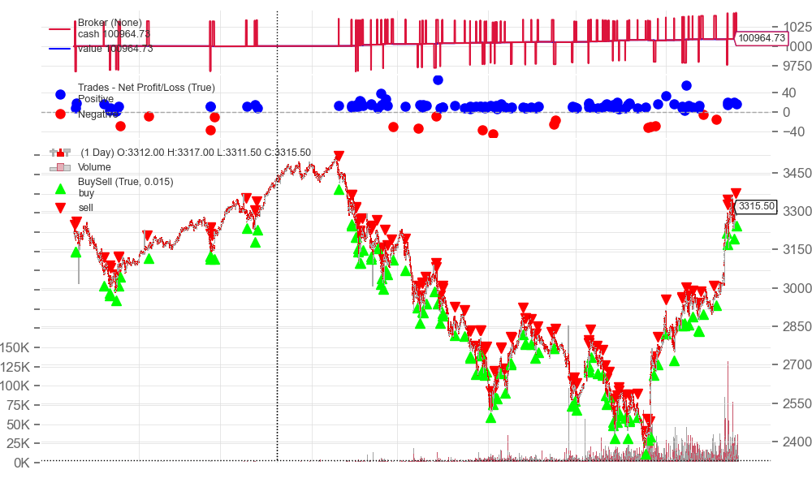

# mean_rev_strategy

## One-liner
Counter-trend mean-reversion strategy for `IMOEXF` on `10m` candles with rule-based entries before midday and fixed exit logic (take/stop/timeout).

## Strategy rules (short)
- Use previous-day range and close as the reference regime.
- Enter long when price is below previous close but not in a strong breakdown.
- Enter short when price is above previous close but not in a strong breakout.
- Limit entries to the first half of the trading day.
- Exit by stop-loss, take-profit, or timeout.

## Data & assumptions
- Source: MOEX candles via `aiomoex` loader (`moex_candles`).
- Instrument: `IMOEXF`.
- Timeframe: `10m`.
- Run window (current showcase): `2020-11-30` to `2025-10-18`.
- Fees: `0.00017` commission per trade side.
- Slippage/market impact: not explicitly modeled.

## Quickstart
```bash
python3 -m venv .venv
source .venv/bin/activate
pip install -r requirements.txt
python scripts/run_backtest.py --config configs/run_c.json
```

## Results
MOEX intraday candles loaded via `aiomoex`; slippage not modeled; commission included.



| Metric | Value |
|---|---:|
| Cumulative Return | 38.55% |
| CAGR | 19.33% |
| Sharpe | 4.44 |
| Sortino | 9.02 |
| Max Drawdown | -3.1% |
| Volatility (ann.) | 5.73% |
| Calmar | 6.23 |

Full report: [reports/run_c/summary.md](reports/run_c/summary.md)

## Limitations
- This is a research repository, not a production trading system.
- Results are sensitive to period selection and may not hold out-of-sample.
- Execution frictions (slippage, latency, partial fills) are simplified.
- No guarantee of future performance.

## Repo map
- `scripts/` - backtest entrypoints
- `configs/` - run configurations
- `reports/` - showcase outputs (equity, HTML report, summary)
- `data/` - local data placeholder (`.gitkeep`)
- `mean_rev_app.py` - core strategy class
- `moex_parser2.py` - data loader utilities
